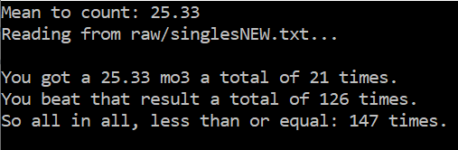
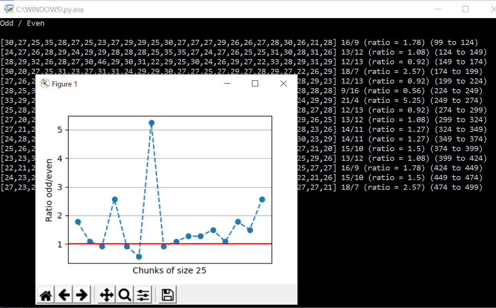

#### _Repository featured on the <a href="https://archiveprogram.github.com/">Github Archive Project!</a>_

### Everything I have about FMC.

- All my solutions
- Some 'theory' that I found useful at some moment
- Data visualization programs in Python
- And whatnot.

# So what the hell is FMC?

FMC stands for "Fewest Moves Challenge" and is an official event recognized by the [World Cube Association](https://www.worldcubeassociation.org/), which involves solving a given scramble for a Rubik's Cube in the fewest moves as possible, with a one hour limit. Competitors shall hand in a written solution after the hour (just like an exam!)

[I've](https://www.worldcubeassociation.org/persons/2013DIPI01) held the title for the Argentinian National Champion, the South American Champion, and held the South American Records for this event several times, being one of the world's top20 best at this event.

---

# What's in here?

## `scripts` folder

Some programs in Python that compute stats and stuff.

- **histoplotter.py**  
  Plots a histogram of all solutions + last by breakpoints.  
  Example usage:  
  `python histoplotter 25,50,75` -> as many as you'd like  
  or `python histoplotter` for default breakpoints (50,100,200).  
  Also displays some other brief stats.
      
- **mo3s.py**  
  Frequency plot of all rolling mo3s in the last N solutions (default: N = all) (using console arguments).  
      
- **mo3-counter.py**  
  Counts how many times you got / beat / got&beat a given mo3 result.
      
- **worst_of_X.py**  
  Mean of worst solution (and 2nd and 3rd worst) by chunks. Partition and scan stats. Customizable sizes.
      
- **splits.py**  
  Computes mean of DR / HTR / finish (estimated) / all, and displays histograms of all those splits (except finish).
      
- **odd-even**  
  I noticed my histoplotter.py graphs was a bit strange... with some tendency towards odd results being much more likely than even. So I just checked it with this program and got shocked.  
  **odd-even-reduced.py**  
  This one measures it on the latest X to S attempts, decreasing by a step of S. For example, last 100, 75, 50, and 25 attempts.
      
  **odd-even-sequential.py**  
  This does the same but by partitioning the set on chunks of size S.
      
- **moreplots.py**  
  Ugly scatter plot with best-fit regression line, my first attempt at visualizing data here.

## `data`

Text files with solutions and results used for computing stats, my own and foreign. Worth noting:

- **\_\_FMC_all.txt**  
  All my FMC solutions. Period.
- **\_\_FMC.txt**  
  All my FMC solutions, skipping the first 100 for more normalized reconstructions.
- **\_\_FMC_num.txt**  
  All my FMC results, numerical result only.
- **\_\_FMC_sub30s.txt**  
  All my FMC solutions that are under 30 moves. Created when these were rare, only kept as a tradition now.

## `solutions`

Some solutions I found especially nice (PBs / interesting solutions), both mine and foreign.
Also reconstructions of all my official FMC attempts (except World's 46).

## `theory`

Things I noticed or found worth pointing out. Some are algorithms, some are ways to solve certain cases, etc.

## `misc`

Random pictures, screencaps, or other documents.
