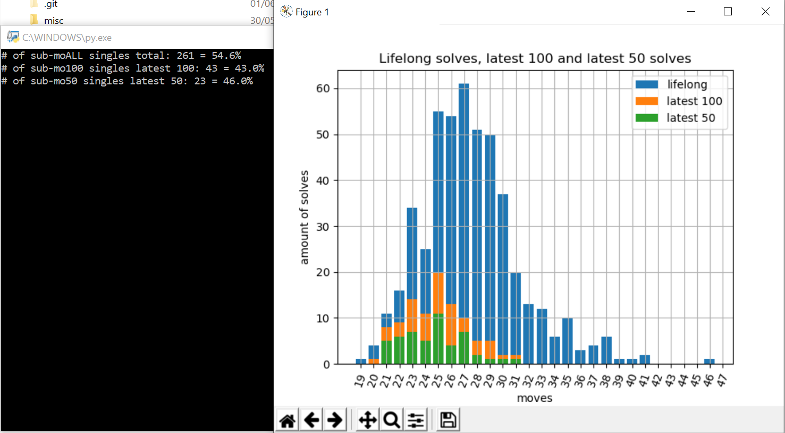
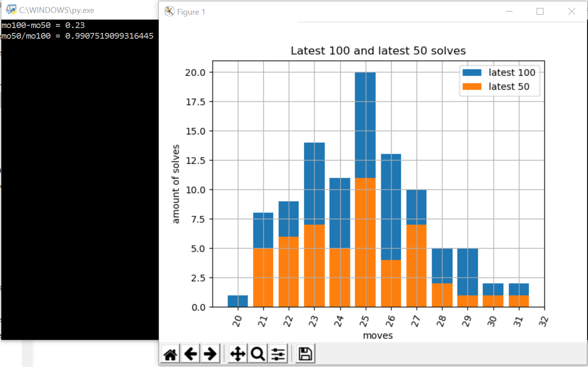
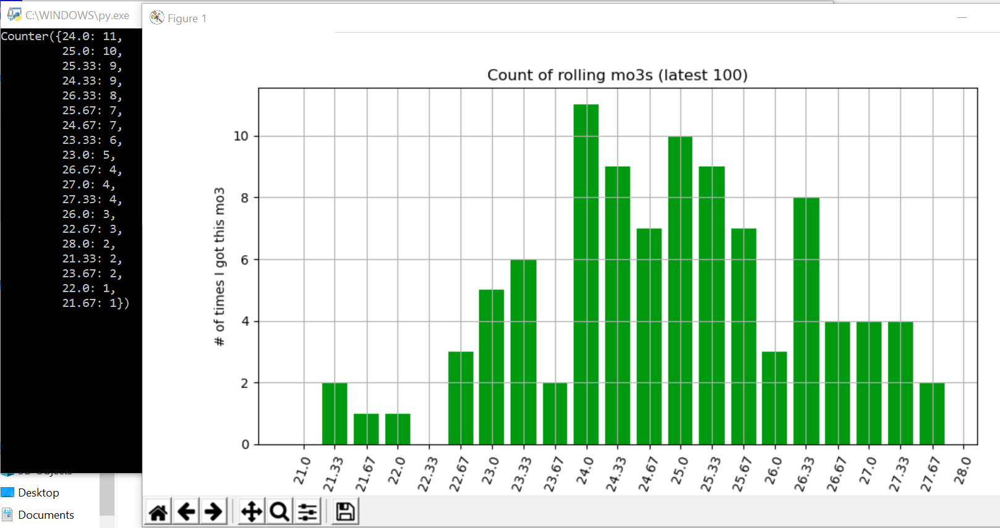
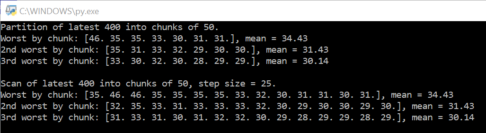
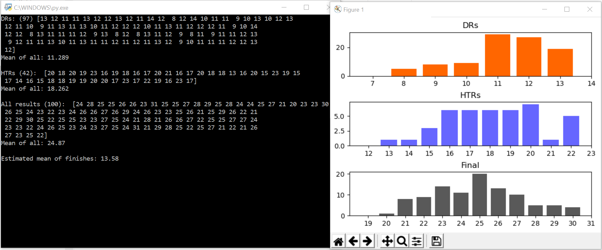
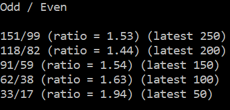
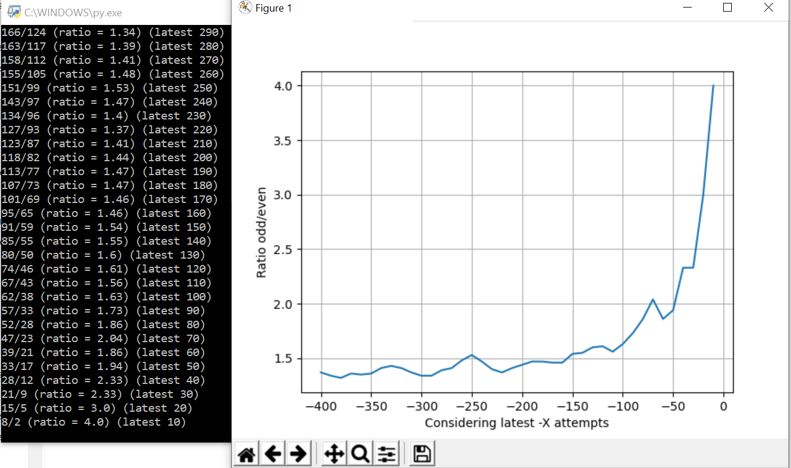

### Everything I have about FMC.  
- All my solutions
- Some 'theory' that I found useful at some moment
- Data visualization programs in Python
- And whatnot.

---

# Main folders and files

## Root folder
Some programs in Python that compute stats and stuff.
- **histoplotter.py**  
  Plots a histogram of all solutions + latest 100 + latest 50. You can easily modify the value of both 'latest's.  
  Also displays some other brief stats.
      
- **histoplotter_100.py**  
  Same as histoplotter but only latest 100 and 50. Also customizable.
      
- **mo3s.py**  
  Frequency plot of all rolling mo3s in the latest 100 solutions.
      
- **worst_of_X.py**  
  Mean of worst solution (and 2nd and 3rd worst) by chunks. Partition and scan stats. Customizable sizes.
      
- **splits.py**  
  Computes mean of DR / HTR / finish (estimated) / all, and displays histograms of all those splits (except finish).
      
- **odd-even.py**  
  I noticed my histoplotter.py graphs was a bit strange... with some tendency towards odd results being much more likely than even. So I just checked it with this program and got shocked.
      
- **moreplots.py**  
  Ugly scatter plot with best-fit line, my first attempt at visualizing data here.
- **FMCavg100.py** and **FMCavg100SessionGetter.py**  
  I have no idea what these do, I'm keeping them in case I remember some day.
- **odd-even**  
  I noticed my histoplotter.py graphs was a bit strange... with some tendency towards odd results being much more likely than even. So I just checked it with this program and got shocked.
  - odd-even-reduced.py  
  This one measures it on the latest X to S attempts, decreasing by a step of S. For example, latest 100, 75, 50, and 25 attempts.
      
  - odd-even-sequential.py
  This does the same but by partitioning the set on chunks of size S.
      
  
## raw
Text files with solutions and results used for computing stats, my own and foreign. Worth noting:
- **_FMC.txt**  
  All my FMC solutions. Period.
- **singlesNEW.txt**  
  All my FMC results, integer result only. (3 digit precision because I feel like it.)
- **AllMySub30s.txt**  
  All my FMC solutions that are under 30 moves. Created when these were rare, only kept as a tradition now.
  
## solutions
Some solutions I found especially nice (PBs / interesting solutions), both mine and foreign.
Also reconstructions of all my official FMC attempts (except World's 46).

## theory stuff
Things I noticed or found worth pointing out. Some are algorithms, some are ways to solve certain cases, etc.

## misc
Random pictures, screencaps, or other documents.
